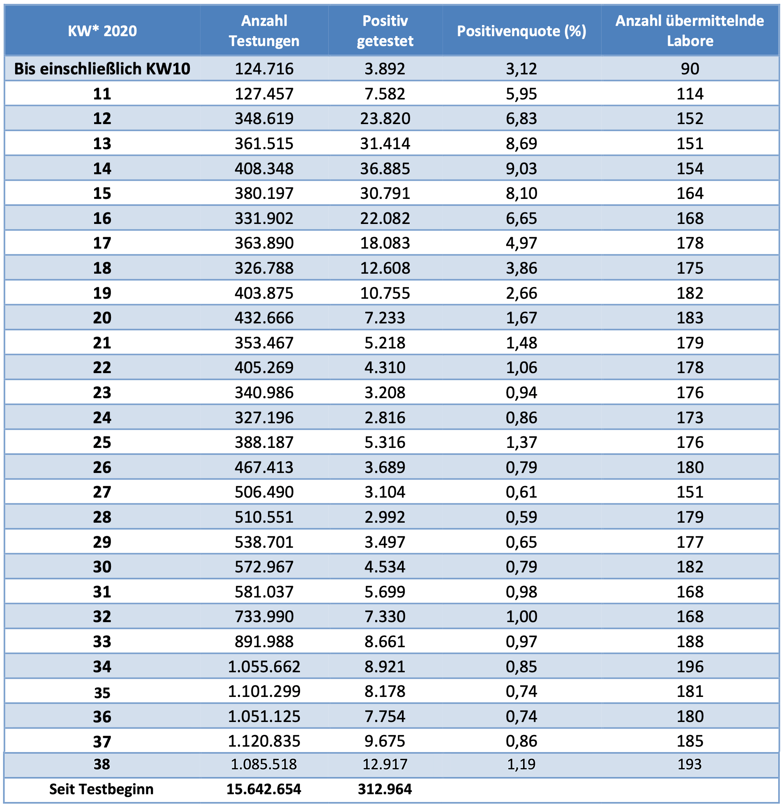

# Zeitleiste "Epidemische Lage von nationaler Tragweite"

## 2019

  * 18.12.: In Mailand und Turin werden routinemäßig Abwasserproben konserviert, in denen bei späteren Untersuchungen [PCR-Tests positiv auf SARS-CoV-2-RNA-Fragmente anschlagen](https://archive.md/jgage).
  * 27.12.: Im Pariser Klinikum Bobigny wird bei einem 42-Jährigen eine schwere Lungeninfektion diagnostiziert, er verläßt nach 2 Tagen wieder das Krankenhaus. Im April 2020 werden eingefrorene Proben nachträglich auf SARS-CoV-2 getestet und es [schlagen PCR-Tests positiv an](https://archive.md/r0aU8) ([Original-Studie](https://archive.md/QMhlU)).
  * 30.12.: Der Augenarzt Li Wenliang warnt innerhalb einer chinesischen Social Media Gruppe (WeChat) vor einem erneuten SARS-Ausbruch angesichts 7 "schwerer Fälle" einer bislang unbekannten Lungenkrankheit in der 10-Millionen-Metropole Wuhan.
  * 31.12.: Einen Tag später schon [geht die Nachricht um die Welt](https://archive.md/6U2gO).

Wenn man den PCR-Tests Glauben schenken darf, ist SARS-CoV-2 also bereits Ende 2019 in Europa präsent. Eine [Studie britischer Wissenschaftler](https://archive.md/vmGJu) verortet den Beginn auf Basis phylogenetischer Schätzungen auf "6. Okt. 2019 bis 11. Dez. 2019".

## 2020

### Januar 2020

*(PCR-Test-Ergebnisse in frühen Studien. Positiv, negativ, positiv, whatever. Die ersten beiden Reihen stellen "schwere Fälle" dar, was sich in den PCR-Test-Werten nicht ansatzweise widerspiegelt)*

  * 1.1.: Professor Drosten beginnt, Genom-Daten aus Datenbanken herunterzuladen mit dem Ziel, Genomsequenzen zu identizifieren, die zu einem (neuen?) Virus passen. Das Ziel ist ein PCR-Test, der klitzekleine aber hoffentlich eindeutige Nukleinsäure-Sequenzen identifizieren soll, die dann den Nachweis einer *akuten* Vireninfektion darstellen sollen. Problemlage: dafür sind PCR-Tests schlecht bis gar nicht geeignet -- ein Praktiker der LMU München bringt es wie folgt auf den Punkt: ["Das Gefährlichste im Bereich der PCR-Analytik ist wohl die Tatsache, dass in der Regel zumindest einige der Proben, besonders bei intensiver und häufiger Testwiederholung, letztendlich immer positiv werden. Also Vorsicht bei der Interpretation der Daten!"](https://coronadatencheck.com/wp-content/uploads/2020/03/PCR-zur-optimierten-Diagnose-viraler-Infekte.pdf). Video-Tipp: [der hochkomplexe und fehlerträchtige Prozeß, der in KW34 knapp 1 Mio. mal am Fließband durchgeführt wird](https://www.youtube.com/watch?v=xcYuyuL6-yw). 
  * 7.1.: in China wird erklärt, dass es sich nicht um das SARS-Virus von 2003 handeln soll sondern um ein neuartiges.
  * 10.1.: Genomsequenzen, die zu dem neuen Virus passen sollen, werden aus China in Genom-Datenbanken hochgeladen. (Quelle: [Drosten-Studie](https://archive.md/MGQqb#selection-1441.3-1457.162)).
  * 16.1.: anhand Datenbank-Downloads, Kot europäischer Fledermäuse und Nukleinsäure-Modellen erstellt Professor Drosten den ersten [Diagnostiktest, der SARS-CoV-2 nachweisen können soll](https://archive.md/wNkXy).
  * 21.1.: die WHO läßt den Drostentest zu (Zulassung ungleich Validierung! Stand August 2020 existiert immer noch für kein einziges der mittlerweile zahllosen kommerziellen PCR-Test-Kits oder die Verfahren der Labore irgendeine Form der Validierung). Labore und Diagnostik*marktteilnehmer* können **erst ab diesem Zeitpunkt** basierend auf der Drosten-Publikation selbst zertifizierte Testkits bauen oder kommerzielle beziehen, die das neuartige SARS-CoV-2-Virus nachweisen können sollen. *Seriöse* Testhersteller attestieren, dass ihr PCR-Test keinesfalls als [alleiniges Indiz für die Diagnose einer Infektion oder gar Erkrankung genutzt werden darf](graphs/CD019RT.pdf).
  * 24.1.: 4 Wochen, nachdem in Frankreich SARS-CoV-2 gemäß PCR-Test das erste mal nachgewiesen werden konnte, hat Frankreich nun offiziell seinen "Patienten 0" (positiver PCR-Test, Verbindungen nach China).
  * 28.1.: Deutschland hat offiziell seinen "Patienten 0" (positiver PCR-Test, Verbindungen nach China).
  * 29.1.: In Bologna werden routinemäßig Abwasserproben konserviert, in denen bei späteren Untersuchungen [PCR-Tests positiv auf SARS-CoV-2-RNA-Fragmente anschlagen](https://archive.md/jgage).
  * [Phylogenetische Untersuchungen in New York](https://archive.md/2M7Hu) legen nahe, dass in der Stadt SARS-CoV-2 seit mindestens Ende Januar 2020 kursiert und mutmaßlich aus Europa und anderen US-Bundesstaaten einreiste (statt aus China).

### Februar 2020

  * Die ersten Studien aus China, die sich dem Nachweis des neuen SARS-CoV-2-Virus widmen, erscheinen (der Drostentest ist bereits seit Wochen im Umlauf). Manche Studien geben es offen zu, bei anderen erfährt man es auf Nachfrage: keine kann ein *isoliertes* Virus zeigen, mithin bleibt offen, ob die Genom-Sequenzen, auf die nun weltweit per PCR getestet wird, von einem aktiven Erreger stammen oder irgendwas anderes, bspw. körpereigene Abbauprodukte. [Die Kochschen Postulate (Nachweis eines krankmachenden Erregers) erfüllt keine der Studien](https://off-guardian.org/2020/06/27/covid19-pcr-tests-are-scientifically-meaningless/).
  * Das RKI entschließt sich, statt von "positiven PCR-Testergebnissen" von "laborbestätigten Neuinfektionen" bzw. "Fällen" zu sprechen. Diese irreführende Umdeutung wird im März dafür sorgen, dass "exponentiell zunehmende" Fallzahlen die Bevölkerung in Angst und Panik versetzen. Ab Mai 2020 sorgt diese Umetikettierung von "PCR-Testergebnis" zu "Neuinfektion" zu einer nie enden wollenden Pandemie.
  * 20.2.: Gut 9 Wochen, nachdem in Italien SARS-CoV-2 gemäß PCR-Test das erste mal in Abwasserproben nachgewiesen werden konnte, [hat Italien nun offiziell seinen Patienten 1](https://archive.md/P9UP2#selection-5639.304-5639.611) (positiver PCR-Test aber keine Verbindungen nach China). Den *einen* "Patienten 0", der das Virus ins Land eingeschleppt haben müsse, sucht man vergeblich und mutmaßt später, dass er [wohl nur mit dem *einen* "Patienten 0" aus Deutschland zusammenhängen könne](https://archive.md/UzK0Y). Auf die Idee, dass erst das Virus und sehr viel später die PCR-Tests kamen, und sich in einer global vernetzten Welt Viren bereits in der Bevölkerung verbreitet haben könnten, bevor Tests, die vorgeben, diese messen zu wollen, überhaupt verfügbar sind, kommt offenbar niemand.
  * 24.2.: Die [Arbeitsgemeinschaft Influenza des RKI (AGI)](https://archive.md/bLNWs#selection-1311.0-1311.43) nimmt ab der 9. Kalenderwoche beginnend mit dem 24.2. SARS-CoV-2 in ihr Monitoring der akuten Atemwegserkrankungen durch die Sentinel-Praxen auf, so dass von nun an repräsentative Informationen über die Ausbreitung des Virus und den Anteil an akuten Atemwegserkrankungen vorliegen. In der KW9 liegt der Anteil von SARS-CoV-2 in den Sentinelpraxen bei 0% während zum Vergleich Influenzaviren mit ca. 40% vertreten sind. ([Quelle](https://influenza.rki.de/Wochenberichte/2019_2020/2020-12.pdf)). RKI-Vizepräsident Schaade erläutert: "[Wir ziehen damit praktisch eine Stichprobe aus der Bevölkerung von Menschen mit Atemwegsinfektionen, um zu schauen, inwieweit sich das neue Virus in der Bevölkerung schon verbreitet hat](https://archive.md/6Ltem#selection-2033.228-2033.413)".

### März 2020

*(die SARS-CoV-2-Massentests erreichen Ende März die höchste Positivrate)*

  * Von der allgemeinen Panik vor einem Killervirus getrieben ändert die Deutsche Gesellschaft für Anästhesiologie & Intensivmedizin die medizinischen Leitlinien zur Versorgung der Corona-Patienten. [Frühzeitiges Intubieren](https://www.youtube.com/watch?v=CSpMWJ-z0zk&feature=youtu.be&t=482) wird empfohlen, dabei massive gesundheitliche Schäden oder Tod für die Betroffenen in Kauf nehmend. In New York wird die "Erfolgsquote" für frühzeitiges Intubieren später bei über 90% liegen (die es nicht überleben).
  * Das RKI rät ebenso dazu, *keine* Obduktionen bei "Corona-Toten" vorzunehmen. [Professor Püschel in Hamburg widersetzt sich dankenswerterweise](https://archive.md/hNSX2) und stellt fest, dass bislang niemand *an* einem neuartigen Virus sondern höchstens *mit einem positiven PCR-Test-Ergebnis* gestorben ist.
  * 2.3.: Vermutlich mindestens 4 Wochen nachdem SARS-CoV-2 in New York schon im Umlauf ist hat die Stadt nun ihren "Patienten 1": Lawrence Garbuz hat den ersten positiven PCR-Test auf SARS-CoV-2, den sich niemand erklären kann, da keine Verbindungen nach China.
  * In der Lombardei kommt die Regionalregierung auf die brilliante Idee, "leichte Coronafälle" aus Krankenhäusern in Pflegeheime zu verlegen. Der medialen Panikmache im Anschluß [geht das ARD-Magazin Monitor Wochen später auf die Spur](https://www.youtube.com/watch?v=UEClGH56CFM). Die Lombardei ist kein Einzelfall. In UK kommt man auf die selbe tolle Idee und in den USA stammen +50% der Corona-Toten aus den 6 Bundesstaaten, die ebenfalls "leichte Fälle" in Pflege- und Altemheime einwiesen. Weltweit ereignen sich bis zu 70% der Corona-Todesfälle in Pflegeeinrichtungen.
  * 8.3.: In der 10. Kalenderwoche meldet die AGI des RKI das erste Auftreten von SARS-CoV-2 in den Sentinelpraxen. SARS-CoV-2 hat nun einen Anteil von 0,4% an den akuten Atemwegserkrankungen. Influenzaviren sind *über hundertmal häufiger* beteiligt ([Quelle](https://influenza.rki.de/Wochenberichte/2019_2020/2020-12.pdf)).
  * 11.3.: WHO erklärt die Covid-19-Pandemie.
  * 11.3.: Die Dänische Regierung ordnet Lockdown-Maßnahmen an und beruft sich dabei angeblich auf die staatliche Gesundheitsbehörde "Sundhedsstyrelsen". Das exakte Gegenteil war der Fall, wie 10 Wochen später publik wird: [die staatliche Gesundheitsbehörde betrachtete die Grenzschließungen als überflüssig und die Schließung von Schulen und Kindergärten als geradezu kontraproduktiv](https://archive.md/Z4jnX#selection-401.0-401.372).
  * Im Dunstkreis des Innenministeriums entsteht ein zunächst geheimes und erst später veröffentlichtes [Strategiepapier "Wie wir COVID-19 unter Kontrolle bekommen"](https://www.bmi.bund.de/SharedDocs/downloads/DE/veroeffentlichungen/2020/corona/szenarienpapier-covid-19.html), das 1 Mio. Coronatote alleine in DE daherprognostiziert und gegenüber der Bevölkerung massive Panikmache empfiehlt ("gewünschte Schockwirkung"). Das BMI kann bis heute weder benennen, welche externen Autoren an welchen Abschnitten des Papiers beteiligt gewesen sind noch kann es einen schriftlichen Auftrag zur Erstellung dieses Papiers vorweisen. ([Korrespondenz mit BMI und Strategiepapier als PDF](https://clubderklarenworte.de/wp-content/uploads/2020/07/E-Mail-Korrespondenz-und-Strategie-Papier.pdf)).
  * 14.3.: [Das Bundesgesundheitsministerium warnt vor Fake-News auf Twitter](https://twitter.com/bmg_bund/status/1238780849652465664?lang=de): "**Achtung Fake News**. Es wird behauptet und rasch verbreitet, das Bundesministerium für Gesundheit / die Bundesregierung würde bald massive weitere Einschränkungen des öffentlichen Lebens ankündigen. Das stimmt NICHT!"
  * 16.3.: zwei Tage später schränken Politiker massiv das Besuchsrecht in Krankenhäusern, Pflegeeinrichtungen, Seniorenheimen und Behinderteneinrichtungen ein, Schulen und Kitas werden geschlossen. Der Bundesgesundheitsminister zu Letzterem, exakt eine Woche vorher: ["Wenn plötzlich alle Schulen zu wären, könnten viele Krankenschwestern und Pfleger mit Kindern nicht mehr arbeiten. Das würde die Gesundheitsversorgung schwächen, nicht stärken."](https://archive.md/PL6c8#selection-3491.318-3491.493)
  * 17.3.: Das RKI setzt die Gefährdungseinschätzung für die Gesundheit der Bevölkerung auf "hoch" und bleibt dabei bis zum heutigen Tage.
  * 21.3.: Weitgehende Ausgangsbeschränkungen werden eingeführt, die Gastronomie und andere "nicht systemrelevante" Branchen müssen zusperren.
  * 22.3.: Bund und Länder beschließen Lockdown.
  * 25.3.: Der Bundestag beschließt eine "Epidemische Lage von nationaler Tragweite".
  * 26.3.: In einem [offenen Brief an die Bundeskanzlerin](https://www.docdroid.net/23IE5dj/sucharit-bhakdi-offener-brief-offentlichkeit-black-pdf#page=2) fragt der emiritierte Mikrobiologieprofessor und Immunologe Professor Bhakdi, ob es bereits eine stichprobenartige Untersuchung der gesunden Allgemeinbevölkerung gegeben habe, um die Realausbreitung des Virus zu validieren, oder dies zeitnah vorgesehen sei (wäre ja durchaus spannend, zu wissen, ob man es mit einer sich ausbreitenden Infektion zu tun hat oder einer, die bereits wieder am Abklingen ist). Solch etwas Elementares hat das RKI bis zum heutigen Tage nie durchgeführt. Als repräsentative Betrachtung des Infektionsgeschehens bleiben also nur die Sentinelpraxen des RKI.
  * 26.3.: Das RKI veröffentlicht im [täglichen Lagebericht](https://www.rki.de/DE/Content/InfAZ/N/Neuartiges_Coronavirus/Situationsberichte/2020-03-26-de.pdf?__blob=publicationFile) erstmals die Anzahl durchgeführter Tests und nicht nur mehr nur "Fallzahlen". Es wird offensichtlich, dass die die Panik befeuernde "exponentielle" Zunahme der Fälle" um das Dreifache zwischen der 11. und 12. Kalenderwoche keine Zunahme an Infektionen war sondern eine Ausweitung der Tests auf das Dreifache bei relativ gleichbleibender Positivenrate (KW11 5,9%, KW12 6,8%). Damit ist klar, dass es eben *keinen* exponentiellen Anstieg an Infektionen Mitte März gegeben hat, da sich bei identischer Teststrategie die Positivenrate nur marginal erhöht hat. Es wurde einfach dreimal so viel getestet. Nichtsdestoweniger war diese "Explosion der Fallzahlen" eine der Säulen für die Verargumentierung aller "Maßnahmen" seit Mitte März.
  * 27.3.: Die Parlamentarier beschließen eine seit dem Ende des Hitlerfaschismus beispiellose Aussetzung und Einschränkung elementarer Grundrechte angesichts einer "Epidemischen Lage von nationaler Tragweite". PCR-Test sticht Grundgesetz.
  * 27.3.: Die mediale Panikmache wirkt. In einem kanadischen Altenheim flohen fast alle Pflegekräfte "vor dem Virus", mindestens 31 Bewohner starben, [dehydriert in ihren eigenen Fäkalien liegend](https://archive.md/2YrAR#selection-4821.0-4821.142).
  * 27.3.: Die Sentinelpraxen der AGI des RKI vermelden für die KW13 den absoluten SARS-CoV-2-Höchststand. Der Anteil an akuten Atemwegserkrankungen liegt bei 3,1%, Influenzaviren sind mit 8% immer noch mehr als doppelt so häufig am Geschehen beteiligt. In der Folgewoche halbiert sich bereits die Anzahl der positiven SARS-CoV-2-Testungen ([Quelle](https://influenza.rki.de/Wochenberichte/2019_2020/2020-17.pdf)).

### April 2020

*(die Häufigkeit des Auftretens von Influenza- und SARS-CoV-2-Viren gemäß dem offiziellen RKI-Surveillance-System für akute Atemwegserkrankungen)*

  * 3.4.: Eines der PCR-Labore teilt mit, dass bei den Massentests von nun an *gemäß WHO-Empfehlung* nicht mehr gezielt auf zwei Gen-Sequenzen getestet wird (E-Gen, das auch in anderen Coronaviren vorkommt und das ORF1-Gen, das spezifisch für SARS-CoV-2 sei) sondern das Testergebnis auch "positiv" gesetzt wird, wenn der Test auch nur auf das unspezifische E-Gen anschlägt. Beim Drostentest wurden "bisher getrennte Screening- und Bestätigungstests durchgeführt. Analog zum oben beschrieben Vorgehen beschränken wir uns aufgrund des hohen positiven Vorhersagewerts bei steigender COVID-19-Prävalenz auf den bisherigen Screeningtest, der auf das E-Gen zielt." ([Quelle](https://archive.md/bnIIW#selection-1315.0-1315.52)). Die Massentests erfolgen ab April nicht mehr spezifisch auf SARS-CoV-2 sondern auf beliebige Coronaviren. 
  * 8.4.: Das RKI inkludiert ab nun in seinen mittwöchlichen Lageberichten Informationen zur Häufigkeit der durchgeführten PCR-Tests (siehe S.12 im [Beispiel](https://www.rki.de/DE/Content/InfAZ/N/Neuartiges_Coronavirus/Situationsberichte/2020-08-19-de.pdf?__blob=publicationFile)). Zu diesem Zeitraum ist die Positivenrate (Anteil positiver PCR-Tests am gesamten Testaufkommen) bereits am Sinken. Waren es in der Kalenderwoche vorher noch 9,03% sind es in dieser KW nur noch 8,10%.
  * 9.4.: Die Bundeskanzlerin teilt mit, [dass die Pandemie so lange weitergehe, bis ein Impfstoff verfügbar sei](https://archive.md/sDA6v).
  * 10.4.: Die Sentinelpraxen der AGI des RKI vermelden für die KW15 nur noch einen einzigen Fall von SARS-CoV-2 (prozentualer Anteil 2,5%). Nach dem 10.4. tritt in den Sentinelpraxen des offiziellen RKI-Surveillance-System für akute Atemwegserkrankungen kein einziger SARS-CoV-2-Fund mehr auf ([Quelle](https://influenza.rki.de/Wochenberichte/2019_2020/2020-20.pdf)).
  * 23.4.: Der Präsident des Weltärztebundes Montgomery erklärt im Ärzteblatt, warum [unsachgemäß gebrauchte Stofflappen im Gesicht nichts bringen bzw. sogar gefährlich sein können](https://archive.md/oHZKY#selection-1019.36-1019.143).
  * 29.4.: Politiker ordnen den "Mund-Nasen-Schutz" im ÖPNV und Einzelhandel auch bundesweit an, nachdem sich in den Wochen zuvor Regionalpolitiker einen Überbietungswettbewerb geliefert hatten, "wer am meisten macht". Masken respektive "Stofflappen im Gesicht" machen sich weder in der Entwicklung der "Fallzahlen" noch in Hospitalisierungsraten in irgendeiner Weise bemerkbar (siehe bspw. DIVI-Intensivregister-Graph weiter unten). Die zuständige Bundesbehörde attestiert ["nutzlos"](https://archive.md/HYS43#selection-2625.1-2625.232).
  * Zwischenzeitlich ist laut der Mittwochsausgabe der täglichen Lageberichte des RKI die Positivenrate der PCR-Testungen bereits auf unter 4% gefallen, im Vergleich zum Höchststand 4 Wochen vorher ein Rückgang auf weniger als die Hälfte.
  * Professor Kuhbandner erklärt, warum die alarmistische Datenaufbereitung des RKI auf einem statistischen Trugschluß beruht und erläutert, warum die Daten mit den allgemein gebräuchlichen statistischen Methoden interpretiert nahelegen, [dass der Höhepunkt des Infektionsgeschehens um die KW13 stattfand](https://www.heise.de/tp/features/Die-Ueberschaetzung-des-tatsaechlichen-Anstiegs-der-Coronavirus-Neuinfektionen-4709977.html) und seitdem stetig am Abklingen ist. Der Höhepunkt der Corona-Pandemie in DE fand Anfang/Mitte März statt, also schon bevor relevant "Massnahmen" verordnet und Grundrechte eingeschränkt oder ausgesetzt wurden.
  * 29.4.: Im Seniorenzentrum Bethel in Trossingen wurde Tage vorher eine PCR-Gruppentestung bei 65 Personen durchgeführt mit 56 positiven Testergebnissen. Da keine der Personen Symptome zeigte, läßt man erneut testen. Neuer Test, neues Glück. Diesmal nur noch 2 Personen mit (falsch) positivem Testergebnis, denen immer noch nichts fehlt: ["Den beiden Senioren geht es gut, bis dato zeigt keine der beiden Damen Symptome."](https://archive.md/m8U1t)

### Mai 2020

*(die anfangs gängige Praxis, Menschen mit positivem PCR-Test "zum Schutz des Personals" intensiv zu beatmen, läßt zumindest in DE ab Ende April nach)*

  * 2.5.: Die Ergebnisse eines Ringtests verschiedener an den PCR-Testungen beteiligter Labore werden bekannt. Die durchschnittliche Spezifität liegt bei 98,6% aber wenn auch harmlose Coronaviren im Spiel sind, bei nur noch 92,4%. Die Auswirkungen bzgl. zu erwartender falsch positiver Testergebnisse sind verheerend, da zu diesem Zeitpunkt die Positivenrate der Massentests bei nur mehr 2,66% liegt (also "kaum mehr Virus da") und das RKI die falsch positiven Befunde weder statistisch aus seinen "Fallzahlen" herauszurechnen versucht, noch dies für die Konstruktion des sog. R-Wertes tut. Der R-Wert wird alleine Dank falsch positiver Tests für immer um 1 herum pendeln und die [Pandemie kann endlos weitergehen](https://multipolar-magazin.de/artikel/warum-die-pandemie-nicht-endet).
  * 4.5.: Die mediale Panikmache hat sich längst verselbständigt. Der Bundesgesundheitsminister: ["Für 80 Prozent der Infizierten gibt es milde oder gar keine Symptome. Die merken faktisch gar nicht, dass sie es haben"](https://archive.md/NE2st#selection-3419.233-3419.352). Der Bayerische Rundfunk hingegen teilt mit, dass auf Ansteckung grundsätzlich Krankheit folge: ["bekommt man dann Fieber, einen trockenen Husten und fühlt sich total schlapp. In 80 Prozent der Fälle bleibt es bei diesem milden Verlauf" und "in etwa 20 Prozent der Fälle verläuft die Krankheit schwerer. ... Ohne Beatmung kann das tödlich enden."](https://www.youtube.com/watch?v=rfdhtpQvpyA)
  * 14.5.: [Die NZZ erklärt auch für Laien verständlich](https://www.nzz.ch/wissenschaft/corona-krise-testen-testen-testen-aber-richtig-ld.1556529), wie bei einer geringen Vortestwahrscheinlichkeit ("kaum mehr Virus da") es bei einem Test mit einer Sensitivität von 99% und einer Spezifität von 98% dazu kommen kann, dass 85% der "Fälle" falsch positiv sind und nur in 15% der Fälle tatsächlich SARS-CoV-2-Genom-Sequenzen nachgewiesen werden konnten.
  * 23.5.: Daten zur Übersterblichkeit in Europa und New York sind vorhanden. Eine Auswertung ergibt für viele Länder ein identisches Bild: [eine *signifikante* Übersterblichkeit setzt erst parallel mit den Lockdowns ein](https://medium.com/@JohnPospichal/questions-for-lockdown-apologists-32a9bbf2e247) und ist unabhängig von der Entwicklung der akuten Atemwegserkrankungen, die überall schon deutlich vorher am Abklingen waren.

### Juni 2020

*(die Grafik zeigt die Auswirkungen in den Intensivstationen basierend auf den ganzen "Corona-Ausbrüchen" seit Mai als auch der "Superspreader-Events" am 6.6.)*

  * 3.6.: "Corona-Ausbruch" unter osteuropäischen Erntehelfern auf Spargelhof in Bayern. Viele positive PCR-Tests, niemand krank, niemand auch nur "milde Symptome". ["Auffällig ist ... dass bei der Testung am Mittwoch keine einzige der getesteten Personen irgendwelche Covid-19-Symptome hatte."](https://archive.md/8SwGT#selection-1875.0-1875.218)
  * 6.6.: "Superspreader-Events" in Form der Anti-Rassismus-Demos hunderttausender Menschen: kaum AHA (Abstand halten, Hygiene, "Alltags"-Masken) und dennoch *keinerlei* Auswirkungen auf "Fallzahlen" oder Hospitalisierungs- und Sterberaten in den Wochen danach.
  * 9.6.: Ab nun setzt [jeder Krankenhausbesuch einen obligatorischen PCR-Test voraus, egal, ob symptomatisch oder nicht](https://archive.md/43v8l#selection-3467.0-3471.98). Die Kosten dafür werden auf die Krankenkassen respektive "Liquiditätsreserve des Gesundheitsfonds" abgewälzt. Damit ist sichergestellt, dass immer in der Statistik ein paar "hospitalisierte Corona-Patienten" auftauchen. Das sind Menschen, die wegen was auch immer in die Klinik müssen, sich einen positiven PCR-Test einfangen und dann in der Statistik als "hospitalisiert" geführt werden. Ist der Patient mit positivem PCR-Test in einem kritischen Zustand und kommt auf die Intensivstation, wird er auch in der RKI-Statistik als "in intensivmedizinischer Behandlung" geführt. Und wenn er stirbt ([30,000 Tote jährlich allein durch Krankenhauskeime in Deutschland](https://archive.md/mZ0Qn#selection-613.344-613.578)) ist er gemäß RKI in jedem Fall "Corona-Toter" (siehe Krefeld-Eintrag vom 6.7. weiter unten).
  * 10.6.: Spargelhof-Fortsetzung. Neue Tests, neues Glück: ["Wie schon beim ersten Reihentest von 50 Mitarbeitern Mitte letzter Woche wiesen die Getesteten ... auch dieses Mal keinerlei Covid-19-Symptome auf."](https://archive.md/8SwGT#selection-1833.0-1833.193)
  * 12.6.: Im deutschen Ärzteblatt wird erklärt, wie PCR-Test-Ergebnisse zu interpretieren sind. Bei "kaum mehr Virus unterwegs" wirken sich Test-Spezifitäten unter 100% drastisch aus. Bei einer angenommenen Prävalenz von 3% und einer Spezifität des PCR-Tests von 95% gilt: ["70 % der als positiv getesteten Personen sind gar nicht positiv, ihnen wird aber Quarantäne verordnet."](https://archive.md/rkZFt#selection-2189.188-2193.214)
  * 15.6.: Spargelhof Teil 3, wieder werden Abstriche genommen, Tests positiv, Menschen gesund: ["Auch bei den jetzt Getesteten waren zum Zeitpunkt des Abstrichs erneut keinerlei typische Covid-19-Symptome zu erkennen. Alle Getesteten machten einen gesunden Eindruck."](https://archive.md/8SwGT#selection-1809.0-1809.169)
  * 16.-20.6.: Symptomunabhängige Massentestungen in einer Fleischfabrik im Kreis Gütersloh (Tönnies): 1413 positive PCR-Tests (Positivenrate 23%), der Kreis Gütersloh schließt Schulen und Kitas und stellt tausende Menschen unter Quarantäne, Menschen aus dem Kreis Gütersloh werden angefeindet und können nicht in den Urlaub fahren. Im Verlauf von 11 Tagen kommt man auf ganze [24 hospitalisierte Tönnies-"Mitarbeiter"](https://www.mags.nrw/sites/default/files/asset/document/200628_wissenschaftliche_stellungnahme_uni_essen.pdf). Nach der keinen wissenschaftlichen Erkenntnissen folgenden RKI-Logik "positiver PCR-Test = infiziert/erkrankt" kommt das Tönnies-Event auf eine Hospitalisierungsrate von 1,7%. Ein interessanter Wert, denn [laut RKI liegt zu diesem Zeitpunkt die allgemeine Hospitalisierungsrate zehnmal höher bei 18%](https://www.rki.de/DE/Content/InfAZ/N/Neuartiges_Coronavirus/Situationsberichte/2020-06-22-de.pdf?__blob=publicationFile). Da laut RKI auch die Sterberate immer noch bei über 4% liegen soll und kein einziger "Corona-Toter" aus dem "Corona-Ausbruch" bei Tönnies resultierte, muß entweder die Knochenarbeit in der Fleischfabrik ein wahrer Gesundbrunnen sein oder die PCR-Testergebnisse wertlos.
  * 18.6.: [Debatte im Bundestag um Aufhebung der "epidemischen Lage von nationaler Tragweite"](https://archive.md/gR4Sj#selection-12227.333-12227.482). Der "Corona-Ausbruch" bei Tönnies kurz zuvor spielt erwartungsgemäß eine wesentliche Rolle für die Entscheidung der Parlamentarier (Beibehaltung des Notstands).
  * 24.6.: Neues Labor, neues Glück. Eines der wenigen Gesundheitsämter, das noch verantwortungsvoll handelt und bei offensichtlich falsch positiven PCR-Test-Ergebnissen (14 in Folge) erneut und woanders testen läßt: ["In einer Mail vom 23. April an das Gesundheitsamt hatte ein Labor erklärt, dass „aktuell kein Bestätigungstest“ mehr durchgeführt wird. „Zum Nachweis des Virus werden Testkits verwendet, die das N-Gen oder das E-Gen nachwiesen (je nach Verfügbarkeit)."](https://archive.md/LAqAD#selection-1385.1-1385.346). Vermutlich werden besagte Labore aber einfach nur den [Vorgaben der WHO von Anfang April](https://archive.md/bnIIW#selection-1353.668-1353.803) folgen?

### Juli 2020

  * 6.7.: Die Stadt Krefeld deckt auf, dass gemäß RKI-Regeln ein positiver SARS-CoV-2-Test immer mit dem Schicksal "Corona-Toter" endet (nach wie vor ist keiner der PCR-Tests für die klinische Diagnose einer Infektion zugelassen und vor 2020 galt in der Medizin noch "Infektion ungleich Erkrankung"). Damit gilt vermutlich auch, dass Covid-19 die einzige Krankheit ist, von der man *niemals* genesen kann. Krefeld hat nun 23 "Corona-Tote", da ["Personen, die einmal positiv auf das Coronavirus getestet wurden und später versterben grundsätzlich in dieser Statistik aufgeführt werden. Im vorliegenden Krefelder Todesfall galt die Person (mittleren Alters und mit multiplen Vorerkrankungen) nachdem es mehrfach negative Testergebnisse gab inzwischen seit längerem als genesen."](https://archive.md/hFNt1#selection-18605.314-18605.957) Mit dieser RKI-Regel ist dafür gesorgt, dass auf unabsehbare Zeit immer mindestens ein paar "Corona-Tote" in der Statistik auftauchen. [Die selbe Methode wende(te)n auch andere Länder an](https://archive.md/WsH4H#selection-409.0-409.185).
  * 14.7.: Es wird gerüchtet, die zwischenzeitlich geänderte Bewertung von "Masken" bzw. Stofflappen seitens WHO [sei auf politische Lobbyarbeit und nicht neue Evidenz zurückzuführen](https://mobile.twitter.com/ClarkeMicah/status/1282987860090593280).
  * 17.7.: Tausende Tönnies-"Beschäftigte", die bislang nicht in ihre Heimatländer zurückkehren konnten, werden seit 4 Wochen in "Quarantäne" gehalten (Bauzaun, Sicherheitsdienst inkl.). Das reicht den Behörden aber noch nicht, kurz vor Mitternacht werden über 700 Briefe verteilt, in denen den Menschen weitere "Quarantäne" angeordnet wird, [auf Basis von erfundenen positiven PCR-Tests, angeblicher Symptome und Einverständnis der Betroffenen](https://archive.md/GB44L#selection-871.433-871.528). Soll das ein Aspekt der "neuen Normalität" sein, an die wir uns zu gewöhnen haben? Menschen grundlos wegsperren?
  * 21.7.: Auch in Österreich wollen sich Politiker profilieren, wer "am meisten tut", und sie ordnen wieder eine Maskenpflicht an. Der Leiter der AGES als zuständiger Gesundheitsagentur weist angesichts dessen darauf hin, [dass sich weder Einführung noch Abschaffung der Maskenpflicht auf die Infektionskurve ausgewirkt hätten: "Zwischen dem, was sich belegen lässt, und dem, was die Politik tut, gibt es einen großen Unterschied."](https://archive.md/rPED2#selection-1397.476-1397.684). Und ["Wenn ich ein Mitarbeiter wäre, der die Maske acht Stunden lang tragen muss, dann würde ich verlangen, dass mir jemand die Notwendigkeit mit Zahlen belegt."](https://archive.md/3nuMP#selection-527.0-536.0)
  * Wovor der Bundesgesundheitsminister Wochen vorher noch gewarnt hat, wird nun konsequent umgesetzt. Am 14.6. noch erklärte Jens Spahn: ["Wenn insgesamt das Infektionsgeschehen immer weiter runtergeht und Sie gleichzeitig das Testen auf Millionen ausweiten, dann haben Sie auf einmal viel mehr falsch Positive als tatsächlich Positive."](https://www.youtube.com/watch?v=L24VACS9lhA). Die Politiker wissen also, was sie tun: Das anlaßlose PCR-Geteste an gesunden Menschen (neue Zielgruppe Reiserückkehrer) sorgt zwangsläufig für extrem viele falsch positive PCR-Testergebnisse bzw. in RKI-Deutsch "Fallzahlen". Im Vergleich zu den Höchstwerten der SARS-CoV-2-Positivraten in den Kalenderwochen 13-15 wurde die Zahl der wöchentlichen Tests fast verdreifacht auf knapp eine Million in KW34 während gleichzeitig die Laborstandards gesenkt wurden (unspezifische Testungen auf beliebige Coronaviren, nur noch Screening- ohne Bestätigungstest)
  * 28.7.: RKI-Präsident Wieler drückt auf einer Pressekonferenz die Besorgnis des RKI ob "steigender Fallzahlen" aus und behauptet, dieser Anstieg hänge "nur damit zusammen", dass die Bevölkerung "nachlässig geworden" sei. Auf Nachfrage, ob diese Aussage irgendwie zu belegen wäre, antwortet das RKI nicht. Auch, wie das RKI gewährleisten könne, dass die Höhe der "Fallzahlen" nicht in erheblichem Maße durch die Ausweitung der Testmenge sowie falsch-positive Testergebnisse bestimmt ist, wurde gleichfalls, trotz mehrfachen schriftlichen und telefonischen Nachfragen, vom RKI nicht beantwortet ([Quelle](https://multipolar-magazin.de/artikel/faktencheck-fallzahlen)).
  * 29.7.: Eine Metaanalyse hat 79 Studien zu SARS-CoV-2, 8 zu SARS-CoV-1 und 11 zu MERS-CoV ausgewertet: [Die mittlere Dauer der Ausscheidung von SARS-CoV-2-RNA in den oberen und den unteren Atemwegen betrug 17,0 beziehungsweise 14,6 Tage. Die maximale Dauer der SARS-CoV-2-RNA-Abgabe war jedoch mit 83 beziehungsweise 59 Tagen erheblich länger](https://archive.md/vnEJQ#selection-1161.84-1161.322). Wie will man mit auf Letzteres abzielenden RNA-Tests auf eine "akute Infektion" oder gar Infektiosität schließen?

### August 2020

*Spanien wurde just zum "Risikogebiet" erklärt aufgrund desselben Phänomens, das man auch hierzulande beobachtet: die Konstruktion einer "2. Welle" aufgrund in die Höhe schießender "Fallzahlen" ohne Konsequenzen für Erkrankungen oder Todesraten. Viel testen bei kaum  Virus ergibt automatisch fast nur noch falsch positive Befunde. Auch in Spanien ist leider das Phänomen feststellbar, dass die Medienmacher sich vollständig in die maßgeblich von ihnen selbst erzeugte Panikmache verrannt und [jeglichen Bezug zur Realität verloren haben](https://youtu.be/wl9h-7MaLws?t=56).*

  * Auch im August 2020 ist nach wir vor kein einziger der verwendeten PCR-Tests amtlich validiert und ebenfalls kein einziger für die Diagnose einer Infektion oder Erkrankung zugelassen. Ungeachtet dessen werden PCR-Tests ausschließlich für genau das genutzt: "Bestätigte Infektionen" bzw. "Fallzahlen" generieren. Ob die PCR-Tests sauber durchgeführt werden (Screening- **und** Bestätigungstest oder nur unspezifisch auf irgendwelche Gen-Sequenzen testen, nötige Sorgfalt, ggf. zweiter Test, wenn erster aufgrund Symptomlosigkeit unplausibel) oder schlichtweg einfach irgenwas testen, ist nicht bekannt.
  * Auch im August 2020 noch schätzt das RKI im Widerspruch zu allen aus dem eigenen Haus stammenden Daten die Gefährdung für die Gesundheit der Bevölkerung auf "hoch" ein.
  * In NRW werden nun auch Schüler genötigt, mitten im Hochsommer den Unterricht mit "Alltagsmasken" über die Dauer des kompletten Schultags hinweg zu meistern. Die Evidenz dafür, dass Masken (und erst recht irgendwelche Stofflappen) *irgendwas* zur Eindämmung einer viralen Infektionskrankheit beitragen könnten, ist schwach bis nicht vorhanden. Professor Drosten brachte es im Januar auf den Punkt (["Die technischen Daten dazu sind nicht gut für das Aufhalten mit der Maske."](https://www.youtube.com/watch?v=ZaqaPGw24_c)) und die Forschung bestätigt ihn seither darin (siehe [hier](https://www.nejm.org/doi/full/10.1056/NEJMp2006372), [hier](https://www.medrxiv.org/content/10.1101/2020.03.30.20047217v2), [hier](https://www.medizin.uni-tuebingen.de/de/das-klinikum/pressemeldungen/261?press_str=), [hier](https://archive.md/y22jF), [hier](https://www.cebm.net/covid-19/masking-lack-of-evidence-with-politics/), [hier](https://www.uea.ac.uk/about/-/new-study-reveals-blueprint-for-getting-out-of-covid-19-lockdown), [hier](https://www.cidrap.umn.edu/news-perspective/2020/04/commentary-masks-all-covid-19-not-based-sound-data), [hier](http://files.fast.ai/papers/masks_lit_review.pdf?fbclid=IwAR3ZERcjMpZkx3Qglprq-RodyMr7lNjrAJmXJwXoq0JNsJMPdEoiyr8I4QA), [hier](https://www.medrxiv.org/content/10.1101/2020.04.01.20049528v1), [hier](https://www.sciencedirect.com/science/article/pii/S0925753520303210), [hier](http://www.asahi.com/ajw/articles/13523664), [hier](https://jamanetwork.com/journals/jama/fullarticle/2762694), [hier](https://www.bfarm.de/SharedDocs/Risikoinformationen/Medizinprodukte/DE/schutzmasken.html), [hier](https://web.archive.org/web/20200509230932/https://www.oralhealthgroup.com/features/face-masks-dont-work-revealing-review/), [hier](https://aaqr.org/articles/aaqr-13-06-oa-0201.pdf) oder [hier](https://www.medrxiv.org/content/10.1101/2020.03.30.20047217v2)). All diese Evidenz [wird von den Stofflappen-Verordnern ausgeblendet](https://archive.md/c6CQf#selection-1675.281-1679.148).
  * 17.8.: Nicht Viktor Orbán, auch nicht Recep Tayyip Erdoğan sondern die Bundeskanzlerin teilt mit, wie man mit 83 Millionen Gäulen umzugehen hat: ["Man muss die Zügel anziehen, um bei Corona nicht in ein Desaster reinzulaufen."](https://archive.md/GLX7E#selection-1131.331-1131.409).

### Oktober 2020

  * 1.10.: Am Vortag läuft planmäßig das [COVID-19-Insolvenzaussetzungsgesetz](https://de.wikipedia.org/wiki/COVID-19-Insolvenzaussetzungsgesetz) aus, die Pleitewelle kann beginnen. Wieviele aktuell in Kurzarbeit befindliche Menschen bald arbeitslos bzw. "Hartz 4"-Empfänger sind, werden wir ab dann so langsam wissen.

## 2022

  * 1.5.2022.: Erst ab diesem Zeitpunkt mit Inkrafttreten der künftigen IVD-Verordnung (IVD = In-vitro-Diagnostika) müssen Corona-Tests amtlich validiert werden: ["Dies erfordert eine Laboruntersuchung der Tests sowie eine unabhängige Überprüfung der Daten"](https://archive.md/cWFfS). Bis dahin können die Testhersteller "selbst zertifizieren und auf eine unabhängige Überprüfung der Tests verzichten, bevor sie auf den Markt gebracht werden".

## RKI-Zahlen

Man muss sich überhaupt nicht mit Viren oder PCR-Test beschäftigen, um ein Bild der Lage zu bekommen. Es reicht wie schon im März auch bereits aus, die offiziellen Zahlen des RKI zu betrachten.

Wir werden aktuell seitens RKI/Politik mit "steigenden Fallzahlen" bzw. angeblichen "Neuinfektionen" konfrontiert, obwohl die Politik sich absolut klar darüber ist, was stattdessen geschieht: der Gesundheitsminister am 14.6. dazu: ["Wenn insgesamt das Infektionsgeschehen immer weiter runtergeht und Sie gleichzeitig das Testen auf Millionen ausweiten, dann haben Sie auf einmal viel mehr falsch Positive als tatsächlich Positive."](https://www.youtube.com/watch?v=L24VACS9lhA).

Wenn es um "Neuinfektionen" gehen würde, dann wäre ein "Ansteigen der Fallzahlen" mit zeitlicher Verzögerung immer auch mit einem Ansteigen der Kranken-, Hospitalisierungs- und Todeszahlen verbunden. Die offiziellen RKI-Zahlen belegen aber das exakte Gegenteil:

Leider ist aufgrund der seltsamen RKI-Regeln davon auszugehen, dass die Anzahl "Corona-Toter" seit spätestens Mitte Juni auch massiv durch falsch positive Testergebnisse beeinflußt wird.

Seit Mitte Juni sind Corona-PCR-Tests im Krankenhaus obligatorisch. Ein Verkehrsunfallopfer, das sich einen (falsch) positiven PCR-Test bei Einlieferung auf die Intensivstation einfängt, wird in der Statistik erst als "Corona-Patient, intensivmedizinisch betreut" geführt, um dann beim Ableben als "Corona-Toter" in die Statistik einzugehen (siehe Eintrag vom 6.7. oben). Laut RKI-Reglement ist Pflicht, dass jeder, der sich irgendwann mal ein (falsch) positives PCR-Testergebnis eingefangen hatte, später als "Corona-Toter" endet (siehe ebenda Krefeld weiter oben).

In einem Land wie DE, das mit [40000 Toten jährlich alleine durch Krankenhauskeime](https://archive.md/rMRKK) einen internationalen Spitzenplatz einnimmt, was die Sterberate in Hospitälern anbelangt, sorgt alleine schon die obligatorische Testpflicht bei Klinikbesuch und die RKI-Regel "positiver PCR-Test = Corona-Toter" für einen nie enden wollenden Nachschub an "Corona-Patienten" und "Corona-Toten".

Wenn man diese Randbedingungen berücksichtigt, muß die oben erwähnte "falsch positiv"-Quote nochmals deutlich höher als die vermuteten 3/4 sein, da ein Teil der "Corona-Toten" ihrerseits schon auf falsch positive Testergebnisse zurückgeht.

## Zeitlos

  * Wer in der Lage ist, sich an vergangene eigene grippale Infekte zu erinnern, dem ist klar, dass die medial aufgebauschte "neuartige" Corona-Symptomatik Geruchs- und Geschmacksverlust Standard ist. Wer sich nicht erinnern kann, muß eben im Web suchen: ["Anosmie"](https://duckduckgo.com/?q=Anosmie&t=hk&ia=web), ["sinusitis geruchsverlust"](https://duckduckgo.com/?q=sinusitis+geruchsverlust&t=hk&ia=web). Auch, dass diese Verluste nach Vireninfektionen für immer anhalten können, [ist leider nichts Neues](https://archive.md/Z9jo0#selection-315.423-315.601) ([Studie von 2013 dazu](https://archive.md/wip/9FKiS))
  * Auch das Risiko von Thrombosen und Lungenembolien ist [nichts wirklich Neues](https://archive.md/xNrms), speziell wenn man Wochen an ein Klinikbett gefesselt ist.
  * Grippewellen der Vorjahre: In Ländern mit kaputtgesparten/privatisierten Gesundheitssystemen bricht wie praktisch jeden Winter die Krankenhausversorgung zusammen (die verstörenden Bilder aus Italien, Madrid und New York, mit denen uns die Medien im März 2020 traktierten, sind dort leider Normalzustand seit vielen Jahren):
    * 2015 [liegen Grippepatienten in Madrid in den Gängen herum](https://archive.md/46pXX)
    * 2017 fragt eine Zeitung ironisch, [warum im Spanischen das Wort Grippe Kollaps bedeutet](https://archive.md/BTTEx).
    * 2017: in ganz Spanien [sind die Kliniken kurz vor dem Zusammenbruch](https://archive.md/H9RIH).
    * [2018 werden in Mailand die Intensivstationen überrannt](https://archive.md/52i4K)
    * [2018 stoßen in den USA alle Kliniken an ihre Kapazitätsgrenzen](https://archive.md/Kpq0O)
    * 2018: Überall in den USA müssen Notzelte errichtet werden und in [Alabama wird sogar der Notstand ausgerufen](https://archive.md/4jyhG)
    * [2018 werden Patienten in den USA hier und dort abgewiesen](https://archive.md/8HMT1)
    * 2018: in Kalifornien gleichen die Kliniken ["Kriegsgebieten"](https://archive.md/rYiAp).
    * [Grippewelle 2018 -Krematorium schlägt Alarm - ARD Brisant 13.03.2018](https://www.youtube.com/watch?v=I6fLjiiHZjA)
    * März 2019: [katastrophale Überbelegung der Kliniken in Madrid](https://archive.md/yastK).
  * In Deutschland sterben jeden Tag im Durchschnitt +2500 Menschen
  * davon sterben im Durchschnitt +2200 Menschen im Alter +65 (jeden Tag)
  * davon sterben im Durchschnitt +1000 Menschen im Alter +80 (jeden Tag)
  * Das [Median- und Durchschnittsalter der deutschen Corona-Toten liegt mit 82](https://de.statista.com/statistik/daten/studie/1104173/umfrage/todesfaelle-aufgrund-des-coronavirus-in-deutschland-nach-geschlecht/) weiterhin über dem durchschnittlichen Sterbealter. Das Mortalitätsprofil entspricht dem der normalen Sterblichkeit. Das gleiche Bild in allen anderen europäischen Ländern.
  * 2007: eine [per PCR-Test vorschnell "nachgewiesene" Epidemie, die gar keine war](https://www.nytimes.com./2007/01/22/health/22whoop.html)
